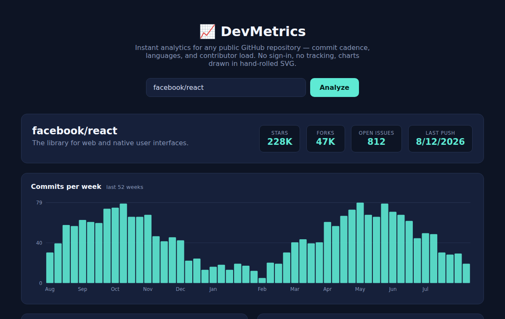

# 📈 DevMetrics

Instant analytics for any public GitHub repository — commit cadence, language breakdown, and contributor load — in a single static page with **zero dependencies**. Every chart is hand-rolled SVG built directly from the GitHub REST API.

 



## Features

- 📊 **Commits per week** — 52-week bar chart with month ticks, y-axis gridlines, and per-bar tooltips
- 🍩 **Language donut** — share by bytes of code, top 7 + "Other", with a computed legend
- 🏆 **Top contributors** — horizontal bars by commit count
- 🔗 **Deep links** — `?repo=owner/name` in the URL re-runs the analysis, so results are shareable
- ⏳ **Real-world API handling** — retries the `202 Accepted` that GitHub's stats endpoints return while computing, and shows friendly messages for 404s and rate limits
- 🚫 **No build step, no framework, no chart library** — one HTML file, one stylesheet, ~300 lines of JS

## Run it

It's a static page — serve the folder any way you like:

```bash
python3 -m http.server 8080
# open http://localhost:8080/?repo=facebook/react
```

Or deploy to GitHub Pages / Netlify / any static host as-is.

## How it works

Three public GitHub endpoints, no auth required (60 requests/hour):

| Endpoint | Used for |
|---|---|
| `GET /repos/{owner}/{repo}` | name, description, stars, forks, issues, last push |
| `GET /repos/{owner}/{repo}/languages` | donut chart (bytes per language) |
| `GET /repos/{owner}/{repo}/contributors` | contributor bars |
| `GET /repos/{owner}/{repo}/stats/commit_activity` | weekly commit bars (with 202-retry) |

## Why hand-rolled SVG?

Chart libraries are great, but for three chart types they're 100× more code than the problem needs. Building the marks directly — `rect` for bars, arc paths for the donut, `text` for axes — keeps the page instant to load, trivially themeable with CSS variables, and demonstrates the geometry most charting work eventually requires anyway (the donut's single-language edge case, where an arc degenerates into a full circle, is handled explicitly).

## License

MIT © Mahden Saleh
