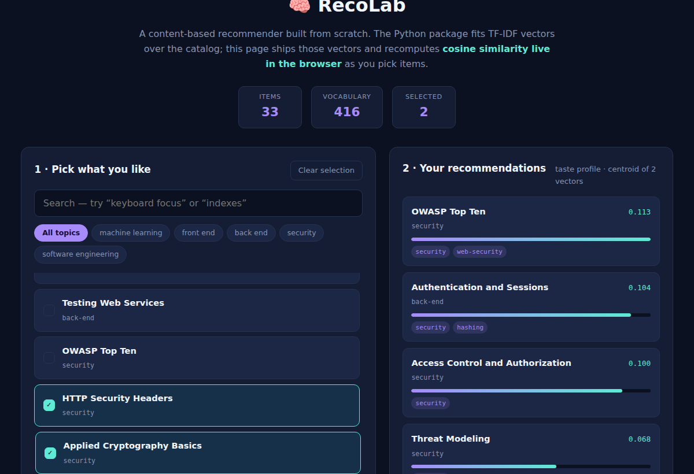

# 🧠 RecoLab

A content-based recommendation engine written **from scratch** — TF-IDF vectorization, cosine similarity, user taste profiles, and ranking metrics, with no numpy and no scikit-learn. The point of the project is that the math is visible and tested rather than imported.

   



## What it does

- **Vectorizes text** — tokenizer that keeps real language names intact (`c++`, `c#`, `node.js`), smoothed IDF, sublinear term frequency, L2 normalization
- **Ranks by similarity** — sparse cosine similarity; nearest neighbours for a single item
- **Builds taste profiles** — averages the vectors of everything a user liked into one centroid, then ranks the catalog against it
- **Searches** — free-text queries scored in the same vector space as the catalog
- **Evaluates** — precision@k, recall@k, MRR, average precision, and NDCG
- **Runs in the browser** — `python -m recolab.export` ships the fitted vectors to a demo page that recomputes cosine similarity in ~30 lines of JavaScript

The browser demo and the Python CLI produce identical scores for the same input — the same algorithm implemented twice, which is a useful check that neither drifted.

## Quick start

```bash
python -m venv .venv && source .venv/bin/activate
pip install -r requirements.txt      # pytest only; the package itself has no deps

pytest -q                            # 56 tests
python -m recolab.cli list           # every module in the sample catalog
python -m recolab.cli similar ml-recsys -k 5
python -m recolab.cli profile sec-headers sec-crypto -k 5
python -m recolab.cli search "keyboard focus management"

python -m recolab.export             # regenerate web/data.json
python -m http.server -d web 8000    # then open http://localhost:8000
```

Example output:

```
$ python -m recolab.cli profile sec-headers sec-crypto -k 3
  OWASP Top Ten                     0.113  ██
  Authentication and Sessions       0.104  ██
  Access Control and Authorization  0.100  ██
```

## How it works

**Weighted documents.** Each catalog item is flattened into one text document, with the title repeated 3× and tags and category 2×, so a term in the title outweighs the same term buried in a description.

**Smoothed IDF.** `idf(t) = ln((1 + N) / (1 + df(t))) + 1`. The smoothing keeps a term that appears in every document from collapsing to exactly zero weight, and guarantees IDF stays positive.

**Sublinear TF.** `1 + ln(count)` — a term mentioned ten times matters more than one mentioned once, but nowhere near ten times more.

**Deterministic ranking.** Ties break on item id, so results never reshuffle between runs. That matters for tests and for a demo that shouldn't reorder itself on every render.

**Sparse vectors.** Vectors are `dict[str, float]`, and the dot product iterates the smaller of the two — the natural representation when 400+ vocabulary terms meet documents of 30 words.

## Project structure

```
├── recolab/
│   ├── text.py          # tokenizer + TfidfVectorizer + normalization
│   ├── similarity.py    # sparse dot product and cosine
│   ├── recommender.py   # ContentRecommender: similar_to / recommend_for_user / search
│   ├── metrics.py       # precision@k, recall@k, MRR, MAP, NDCG
│   ├── catalog.py       # 33-module sample catalog
│   ├── cli.py           # command-line interface
│   └── export.py        # writes web/data.json for the demo
├── tests/               # 56 pytest tests
└── web/                 # zero-dependency browser demo
```

## Where this came from

My thesis project, **IDA**, used content-based filtering to generate personalized learning paths for Grade 4 mathematics students. RecoLab is that idea rebuilt as a clean, tested, standalone library — the recommendation core separated from the application around it.

## License

MIT © Mahden Saleh
