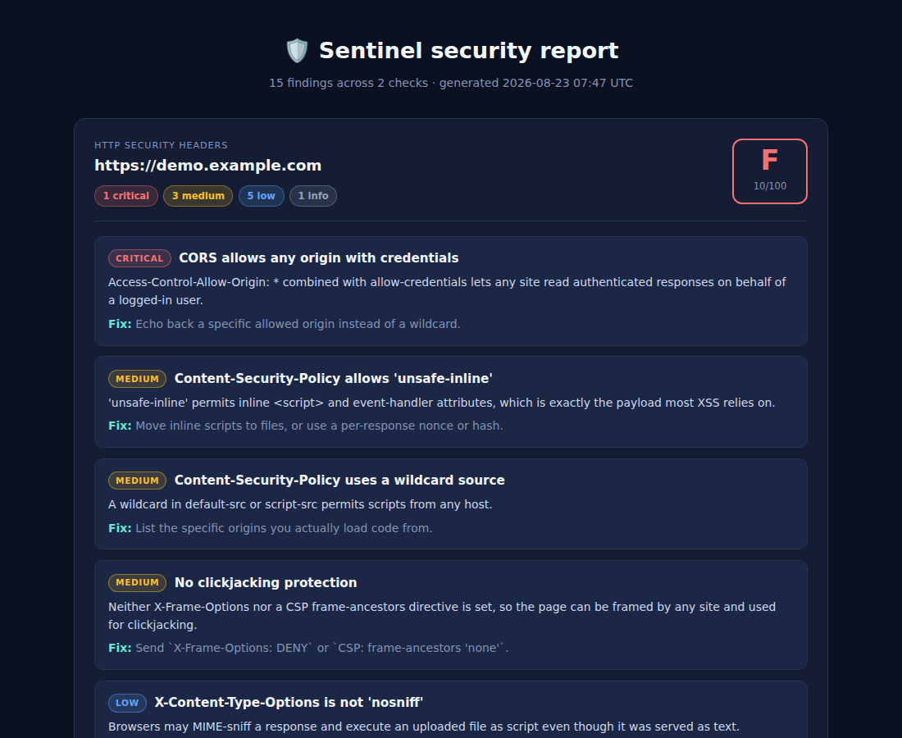

# 🛡️ Sentinel

A **defensive** security auditing toolkit: it checks your own site's HTTP headers, finds credentials you accidentally committed, and scores password strength. Pure Python standard library, no runtime dependencies.

   



## What it checks

### 1. HTTP security headers
Grades a response A–F against the headers browsers actually enforce, and — more usefully — flags headers that are *present but weak*, which is the common real-world case:

- Content-Security-Policy: missing, `unsafe-inline`, `unsafe-eval`, or wildcard sources
- Strict-Transport-Security: missing, no `max-age`, or a `max-age` too short to matter
- Clickjacking: missing `X-Frame-Options` **and** no CSP `frame-ancestors` (either one satisfies the check)
- `X-Content-Type-Options: nosniff`, `Referrer-Policy`, `Permissions-Policy`
- Software disclosure via `Server` / `X-Powered-By`
- `Access-Control-Allow-Origin: *` together with `allow-credentials` — critical, because any site can then read authenticated responses

### 2. Committed secrets
Recursively scans a source tree for credentials, reporting **file and line with the value redacted** — the job is to tell you where the secret is, not to copy it somewhere new:

- AWS access keys, GitHub and Slack tokens, PEM private key blocks
- Database URLs with inline passwords
- JWTs, and generic `SECRET_KEY = "…"` style assignments (affixed names like `DB_PASSWORD` and `registryToken` included)
- Placeholders (`<your-key>`, `${VAR}`, `changeme`) and low-entropy values are ignored, and `node_modules/`, `.venv/`, binaries, and minified bundles are skipped

### 3. Password strength
Entropy in bits from the character-set size, then deductions for the patterns that make a high-entropy password guessable anyway: breach-list membership, a common word with digits bolted on (`Password123!`), keyboard runs, and repeats. Returns a 0–4 score with specific advice.

> The breach check uses a short embedded list. In production this belongs behind an API like Have I Been Pwned's k-anonymity endpoint, which never receives the password itself.

## Quick start

```bash
python -m venv .venv && source .venv/bin/activate
pip install -r requirements.txt          # pytest only

pytest -q                                # 90 tests

python -m sentinel.cli headers --url https://example.com
python -m sentinel.cli headers --file samples/headers.json
python -m sentinel.cli secrets ./src
python -m sentinel.cli password 'Password123!'
python -m sentinel.cli demo --html report.html    # audits the bundled samples
```

Every command exits non-zero when it finds something above LOW severity, so it drops straight into a CI pipeline:

```yaml
- run: python -m sentinel.cli secrets .
```

Example:

```
$ python -m sentinel.cli password 'Password123!'
Strength: weak  [██░░░]  78.8 bits
  ⚠  This is a common password with digits or symbols added — a pattern cracking tools try first.
  →  Consider a passphrase of four or more unrelated words.

$ python -m sentinel.cli secrets samples
Secret scan — samples
Grade F  (10/100)   findings: 5
HIGH     Hardcoded credential [app/config.py:12]
         Matched `9f2c********7b21` in source.
         fix: Read the value from an environment variable or a secret manager.
```

## Design notes

- **Scope is defensive.** Everything here audits systems you already control: your own response headers, your own repository, your own password field. There is no exploitation, no scanning of third-party hosts, and the header check sends a single `HEAD` request.
- **Weighted grading.** Findings deduct from 100 by severity (critical 40, high 20, medium 10, low 4) and the score floors at zero, so one critical finding can't be averaged away by a pile of passing checks.
- **Redaction is not optional.** `redact()` runs before a value ever reaches a finding, and a test asserts no raw secret appears in any report output.
- **False positives are the failure mode that gets a scanner turned off**, so placeholders, low-entropy values, vendored directories, and minified lines are filtered out — and each of those filters has a test.
- **No realistic credentials in the repo.** The test fixtures build vendor-format tokens by joining fragments at runtime, so this repository never contains a literal string that a platform secret scanner would flag.

## Project structure

```
├── sentinel/
│   ├── findings.py     # Finding / Report model, severity weighting, A–F grading
│   ├── headers.py      # HTTP security header analysis
│   ├── secrets.py      # credential patterns, entropy, redaction, tree walking
│   ├── passwords.py    # entropy scoring and pattern penalties
│   ├── report.py       # text and self-contained HTML renderers
│   └── cli.py          # command-line interface
├── samples/            # deliberately insecure fixtures for the demo
└── tests/              # 90 pytest tests
```

## License

MIT © Mahden Saleh
