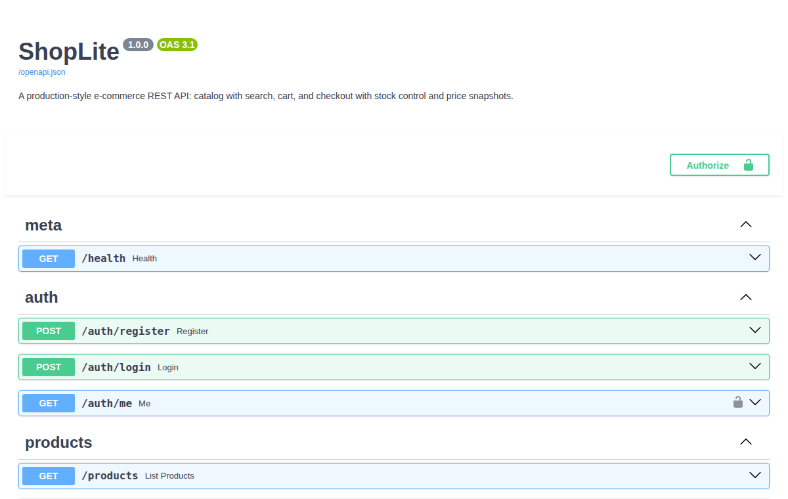

# 🛒 ShopLite

A production-style e-commerce REST API built with **FastAPI** and **SQLAlchemy 2.0**: a searchable product catalog, per-user carts with stock control, and checkout that snapshots prices into immutable order history.

   



## Features

- 🔐 **Auth** — JWT bearer tokens; PBKDF2-HMAC-SHA256 password hashing with per-user salts (stdlib, no native deps); identical errors for wrong-password vs unknown-email
- 🔎 **Catalog** — public product listing with text search (name + description), category filter, and pagination; admin-only create/update/delete
- 🛒 **Cart** — per-user carts that merge duplicate adds and refuse to exceed available stock (`409` with a helpful message)
- 💳 **Checkout** — re-validates stock, decrements it, clears the cart, and generates a payment reference in one transaction
- 🧾 **Immutable order history** — each order line snapshots the product name and unit price at purchase time, so catalog edits never rewrite what a customer paid *(verified by test)*
- 💰 **Money as integer cents** — no floating-point rounding anywhere
- 🧪 **22 pytest tests** — full-stack tests through FastAPI's `TestClient` covering auth, permissions, search, stock limits, checkout, and cross-user privacy
- 📖 **Self-documenting** — interactive OpenAPI docs at `/docs` out of the box

## Quick start

```bash
python -m venv .venv && source .venv/bin/activate
pip install -r requirements.txt

python -m app.seed                  # admin user + 8 sample products
uvicorn app.main:app --reload       # http://localhost:8000/docs
pytest                              # run the test suite
```

Environment variables (all optional):

| Variable | Default | Purpose |
|---|---|---|
| `DATABASE_URL` | `sqlite:///./shoplite.db` | Any SQLAlchemy URL (Postgres-ready) |
| `JWT_SECRET` | dev value | **Set this in production** |

## API overview

```
POST   /auth/register            {name, email, password}    → 201 {token, user}
POST   /auth/login               {email, password}          → {token, user}
GET    /auth/me                                             → {user}

GET    /products?q=&category=&page=&page_size=              → {items, total, page, page_size}
GET    /products/{id}                                       → product
POST   /products                 (admin)                    → 201 product
PUT    /products/{id}            (admin)
DELETE /products/{id}            (admin)                    → 204

GET    /cart                                                → {items, subtotal_cents}
POST   /cart/items               {product_id, quantity}     → 201 cart
PUT    /cart/items/{product_id}  {quantity}                 → cart
DELETE /cart/items/{product_id}                             → cart

POST   /orders/checkout                                     → 201 order
GET    /orders                                              → [orders]
GET    /orders/{id}                                         → order
```

## Design notes

- **Price snapshots over foreign-key lookups** — `OrderItem` copies `product_name` and `unit_price_cents` at checkout. Orders are financial records; they must not change when the catalog does.
- **Stock is enforced twice** — at cart-add time (good UX: fail early) and again inside checkout (correctness: the cart may be stale). The checkout path is the source of truth.
- **Stdlib password hashing** — PBKDF2 at 200k iterations keeps the dependency tree small and installs everywhere; the format string (`pbkdf2$iterations$salt$digest`) leaves room to migrate algorithms later.
- **SQLAlchemy 2.0 style** — typed `Mapped[]` models and `select()` queries throughout; `selectinload` where lists are serialized to avoid N+1 queries.

## Project structure

```
├── app/
│   ├── main.py           # app factory + router registration
│   ├── database.py       # engine, session dependency, FK pragma
│   ├── models.py         # User, Product, CartItem, Order, OrderItem
│   ├── schemas.py        # Pydantic request/response models
│   ├── security.py       # PBKDF2 hashing, JWT, auth dependencies
│   ├── seed.py           # sample catalog seeder (python -m app.seed)
│   └── routers/          # auth, products, cart, orders
└── tests/                # 22 end-to-end API tests
```

## License

MIT © Mahden Saleh
