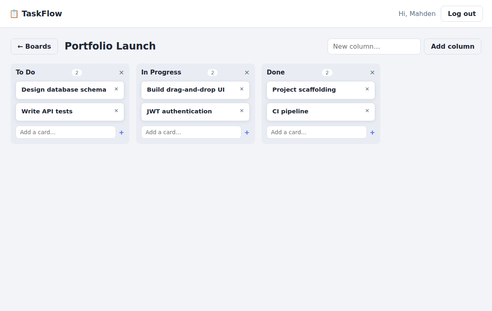

# 📋 TaskFlow

A full-stack Kanban task manager: an Express REST API with JWT authentication and SQLite persistence, plus a **dependency-free** vanilla-JS front end with native HTML5 drag-and-drop.

  



## Features

- 🔐 **Auth** — register/login with bcrypt-hashed passwords and 7-day JWTs; identical error messages for wrong-password vs unknown-email so accounts can't be enumerated
- 🗂 **Boards → columns → cards** — full CRUD, with every new board seeded with *To Do / In Progress / Done*
- 🖱 **Drag & drop** — move cards between columns; the server renumbers both affected columns in a single SQLite transaction so positions stay dense no matter what the client sends
- 🛡 **Ownership enforcement** — every query joins through to `boards.user_id`; users can't read, move, or delete anything they don't own (verified by tests)
- 🧪 **22 API tests** — Jest + Supertest against an in-memory SQLite database, covering auth, validation, cross-user access, card movement edge cases, and error handling

## Quick start

```bash
npm install
npm start          # http://localhost:3000
npm test           # run the API test suite
```

Environment variables (all optional):

| Variable | Default | Purpose |
|---|---|---|
| `PORT` | `3000` | HTTP port |
| `DB_PATH` | `taskflow.db` | SQLite file location |
| `JWT_SECRET` | dev value | **Set this in production** |

## API overview

```
POST   /api/auth/register        {name, email, password} → {token, user}
POST   /api/auth/login           {email, password}       → {token, user}
GET    /api/auth/me                                      → {user}

GET    /api/boards                                       → {boards: [...]}
POST   /api/boards               {title}                 → {board}
GET    /api/boards/:id                                   → {board: {columns: [{cards}]}}
PATCH  /api/boards/:id           {title}
DELETE /api/boards/:id

POST   /api/boards/:id/columns   {title}                 → {column}
PATCH  /api/columns/:id          {title}
DELETE /api/columns/:id

POST   /api/columns/:id/cards    {title, description?}   → {card}
PATCH  /api/cards/:id            {title?, description?, columnId?, position?}
DELETE /api/cards/:id
```

All board/column/card routes require `Authorization: Bearer <token>`.

## Design notes

- **App factory** (`createApp(dbPath)`) — the Express app is built around an injected database path, so tests run against `:memory:` with zero mocking and full end-to-end coverage.
- **Dense positions** — card ordering uses integer positions renumbered transactionally on every move. Simpler and more robust than fractional ranking for boards of this size, and the tradeoff is documented where it lives.
- **`better-sqlite3`** — synchronous SQLite fits Express's per-request model well at this scale and keeps the code free of await-noise; WAL mode keeps reads fast.
- **No front-end framework** — the UI is ~300 lines of vanilla JS with event delegation and optimistic re-fetching, which keeps the project honest about fundamentals: DOM, events, drag-and-drop, and fetch.

## Project structure

```
├── server.js              # entry point
├── src/
│   ├── app.js             # app factory (static + routes + error handling)
│   ├── db.js              # schema + connection (WAL, foreign keys)
│   ├── auth.js            # JWT sign/verify middleware
│   └── routes/
│       ├── auth.js        # register / login / me
│       └── boards.js      # boards, columns, cards (+ownership checks)
├── public/                # vanilla JS front end
└── tests/api.test.js      # 22 Jest + Supertest API tests
```

## License

MIT © Mahden Saleh
