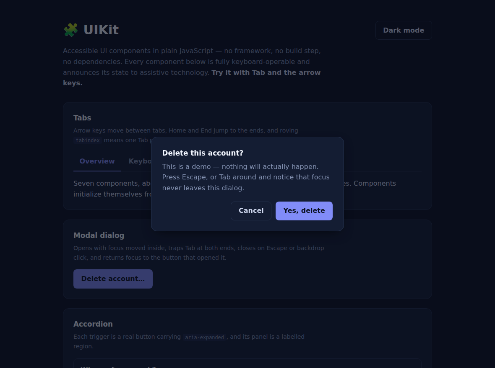

# 🧩 UIKit

Accessible UI components in **plain JavaScript** — no framework, no build step, no runtime dependencies. Seven components in about 400 lines, each keyboard-operable and each announcing its state to assistive technology.

  



## Components

| Component | What makes it accessible |
|---|---|
| **Modal** | Moves focus inside on open, traps Tab at both ends, closes on Escape or backdrop click, **restores focus to the trigger**, `role="dialog"` + `aria-modal` |
| **Tabs** | Arrow keys move selection, Home/End jump to the ends, roving `tabindex` so one Tab press leaves the whole tablist, `aria-selected` + `aria-controls` |
| **Accordion** | Real `<button>` triggers with `aria-expanded`, panels are labelled regions, optional single-open mode |
| **Combobox** | Type to filter, arrows to highlight, Enter to select, Escape to close — focus stays in the input while `aria-activedescendant` points at the highlighted option |
| **Toast** | Renders into a `role="status"` / `aria-live="polite"` region, so it never interrupts what the user is reading; each has a labelled dismiss button |
| **Form validation** | `aria-invalid` on fields, messages wired via `aria-describedby`, live re-validation once a field is already invalid, and focus moved to the first problem on submit |
| **Theme toggle** | `aria-pressed` reflects state, persists to `localStorage` inside a `try/catch` so private-mode browsers still work |

## Usage

Drop in two files and mark up your HTML — components initialize themselves:

```html
<link rel="stylesheet" href="src/uikit.css" />
<script src="src/uikit.js"></script>

<div data-uikit="tabs">
  <div class="uikit-tabs-list">
    <button class="uikit-tab" data-uikit-tab="selected">Overview</button>
    <button class="uikit-tab" data-uikit-tab>Details</button>
  </div>
  <div class="uikit-panel" data-uikit-panel>…</div>
  <div class="uikit-panel" data-uikit-panel>…</div>
</div>
```

Or construct them directly:

```js
const modal = new UIKit.Modal(document.querySelector("#confirm"));
modal.open();

UIKit.toast("Account created.", { variant: "success" });
```

Components emit events you can hook: `uikit:open`, `uikit:close`, `uikit:tabchange`, `uikit:select`, `uikit:valid`.

## Theming

Every color is a custom property. Override the `--uikit-*` variables, or set `data-theme="dark"` on `<html>`:

```css
:root {
  --uikit-accent: #0ea5e9;
  --uikit-radius: 4px;
}
```

## Running it

```bash
npm install          # Playwright, for the tests only
npm start            # serves the demo at http://localhost:8080
npm test             # 27 keyboard and ARIA tests
```

## How it's tested

The suite drives the demo page in a real browser with **real key presses** and asserts focus position and ARIA state after each one — where focus lands when a modal opens, that Tab wraps at both ends, that Escape restores focus to the trigger, that `aria-activedescendant` matches the highlighted option. Unit-testing the classes in isolation would pass while missing exactly those bugs.

```
Modal
  ✓ opening moves focus into the dialog
  ✓ Tab wraps forward at the end of the dialog
  ✓ Shift+Tab wraps backward
  ✓ Escape closes and restores focus to the trigger
```

## Design notes

- **Focus is never removed, only redirected.** There is one `:focus-visible` style shared by every component, and no `outline: none` anywhere in the stylesheet.
- **ARIA describes state the DOM already has.** Attributes are set from the same code path that changes the visual state, so the two can't drift apart.
- **`aria-activedescendant` over moving focus** in the combobox: focus stays in the input so typing keeps working, while screen readers still announce the highlighted option.
- **Progressive enhancement.** The form uses `novalidate` and validates in JS, but every field is a real labelled input inside a real form — it degrades to a normal submission if the script fails to load.
- **Reduced motion is respected** globally via `prefers-reduced-motion`.

## License

MIT © Mahden Saleh
